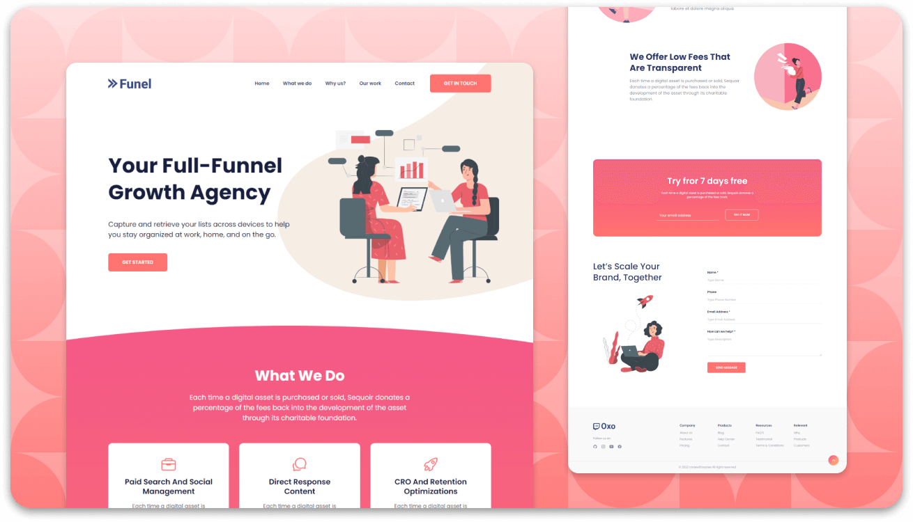

  
___ 

  

   
   
  
  

   

  <h1 align="center">Funel - Agency landing page</h1>

  Funel is a fully responsive digital agency landing page,  Responsive for all devices, built using HTML, CSS, and JavaScript.

 
 

### Demo Screeshots

### Prerequisites

Before you begin, ensure you have met the following requirements:

* [Git](https://git-scm.com/downloads "Download Git") must be installed on your operating system.

<!-- License -->
## License
This project is licensed under the [MIT License](LICENSE).

<!-- Acknowledgments -->
## Acknowledgments
Thank you to the HTML5, CSS3, JavaScript And Figma communities for providing excellent tools and resources.

<!-- Contact -->
## Contact
For questions or feedback, please contact [Amit Ashok Swain](mailto:business.amitswain@gmail.com).
